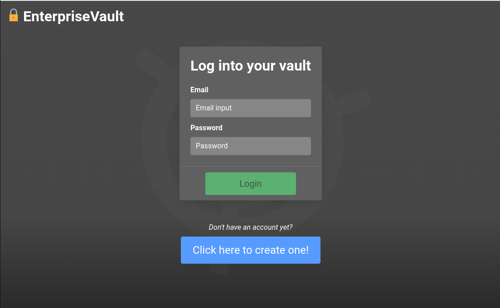
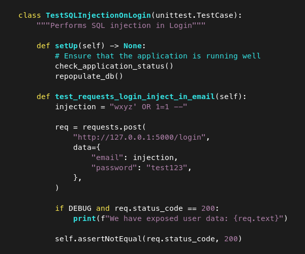

---
title:
- Web Application Security
subtitle:
- Security and Network Systems project presentation
author:
- C. Simões
- N. Hopf
- R. Gomes
- V. Dutra
institute:
- MEEC-FEUP
theme:
- Montpellier
colortheme:
- beaver
fonttheme:
- professionalfonts
fontsize:
- 12pt
urlcolor:
- red
linkstyle:
- bold
aspectratio:
- 169
section-titles:
- false
date:
- May 2023 
---

# Context
## Objectives

 - The world is exceedingly reliant on the Internet and web security is still a critical challenge in the corporate world.

 - From Banking to E-Commerce, several applications today are high-value targets and cannot be prone to exploits

> Understanding the concerns and best practices is fundamental for a modern web application developer

## Methodology
Since web security is an extensive domain, our first concern was defining a strict scope for this project:

1. Conceptualize a product that we will use as context for exploring the security procedures

2. Create a simple (vulnerable) implementation for the product

3. Exploit the vulnerabilities of the first application through unit tests

4. Modify the vulnerable application to make it resilient against all exploits (TDD)

5. Recreate the application using industry-standard solutions instead of relying on our own implementation

# Implementation
## Concept
Create a **vault** in which visitors can:

 - Register with a name, email and a password

- Log in with that email and password

- Upload an image and a secret phrase, when logged in

- See their image and secret phrase, when logged in

- Change (only) their image and secret phrase, when logged in

- See other people's names, but not their image or secret phrase

---

## Exploits
::: {.columns align=center}
:::: {.column width=50%}

- SQL injection on sign up
\medskip
- Dictionary attack on login
\medskip
- XSS on sign up
\medskip
- Image content exploit
\medskip
- Cross-site request forgery
\medskip
- Timing attacks
\medskip
- Server access compromising

::::
:::: {.column width=50%}

{ height=240px }

::::
:::

## Security Fixes

- Templating in Flask and SQLite sanitization

- Do not allow users to input simple passwords and use fail2ban on the server

- Use the default Jinja2 template engine, as it escapes special characters such as `<`, `>` and `/`

- Image metadata is removed to prevent code execution in older browsers

- Create a single-use authentication process (no session cookie)

- Perform hashing and salting for every password and use fail2ban on the server

- Configure SSH keys and UFW (firewall)

## Demonstração
{ height=250px }

# Referências
1. L. Ma, D. Zhao, Y. Gao and C. Zhao, "Research on SQL Injection Attack and Prevention Technology Based on Web," 2019 International Conference on Computer Network, Electronic and Automation (ICCNEA), Xi'an, China, 2019, pp. 176-179, doi: 10.1109/ICCNEA.2019.00042.

2. S. Kumar, R. Mahajan, N. Kumar and S. K. Khatri, "A study on web application security and detecting security vulnerabilities," 2017 6th International Conference on Reliability, Infocom Technologies and Optimization (Trends and Future Directions) (ICRITO), Noida, India, 2017, pp. 451-455, doi: 10.1109/ICRITO.2017.8342469.

---

3. K. Zhang, "A Machine Learning Based Approach to Identify SQL Injection Vulnerabilities," 2019 34th IEEE/ACM International Conference on Automated Software Engineering (ASE), San Diego, CA, USA, 2019, pp. 1286-1288, doi: 10.1109/ASE.2019.00164.

